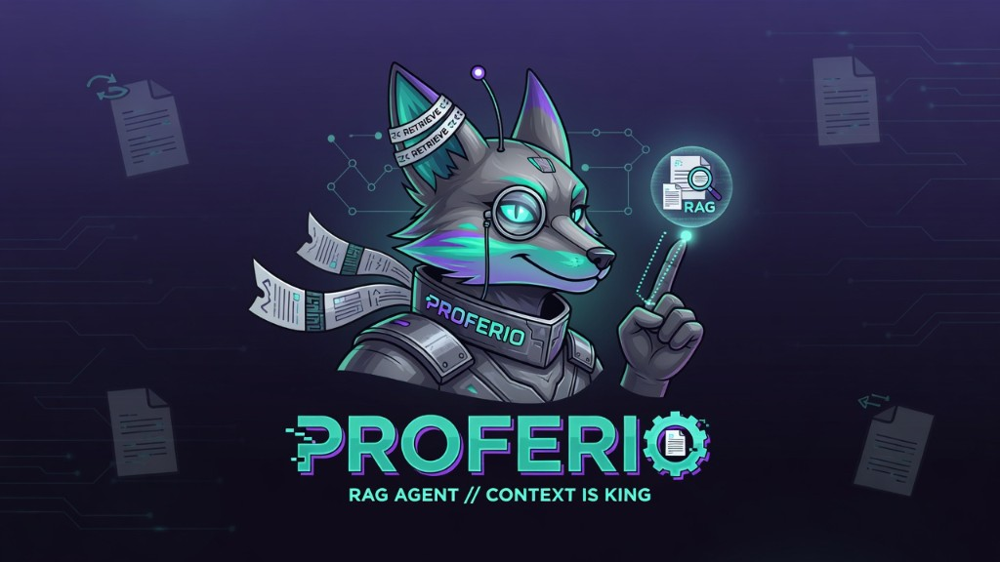

<p align="center">
  
</p>

# Proferio

> Local-first RAG + controllable agents — grounded, auditable, runnable on consumer hardware.

[](#quick-start)
[](#why-this-repo)
[](LICENSE)

Proferio is a clean, auditable, notebook-first starter kit for **local RAG + controllable agents** with grounded answers, explicit source traces, and out-of-scope routing. It is designed for learning and rapid prototyping on consumer hardware, not as a drop-in production framework.

---

## Why This Repo

Most local RAG repos are either toy demos or fragmented snippets. This project is built to be:

- **Runnable fast** on consumer hardware
- **Auditable by default** (answer + source snippets + status)
- **Modular** (notebook UX + reusable `src/` package)
- **Demo-ready** with Gradio and smoke checks

---

## What You Get

- End-to-end local RAG pipeline (`notebooks/01_local_rag_pipeline.ipynb`)
- ReAct-style agent extension (`notebooks/02_agent_extension.ipynb`)
- Advanced tracks for reranker tuning, multimodal, and benchmarks (`03-05`)
- Local LLM backend support (`ollama`, `hf`, `fallback`) with safe fallback
- Retrieval stack: hybrid vector + BM25 fusion, multi-query expansion, lexical/semantic rerank, diversity penalty
- Guardrails: `grounded`, `out_of_scope`, `no_documents`, `no_retrieval_hits`

---

## Architecture

See `docs/ARCHITECTURE.md` for full details.

High-level flow:

1. Load docs
2. Chunk + embed
3. Retrieve + rerank
4. Generate grounded answer with citations
5. Return structured status + contexts

---

## Quick Start

### 1) Install

```bash
pip install -r requirements.txt
```

or

```bash
conda env create -f environment.yml
conda activate proferio
```

### 2) Local Model Runtime (optional — full generation)

```bash
ollama pull llama3.1:8b
```

On **RunPod** (recommended if your laptop cannot run the stack), see [`docs/RUNPOD.md`](docs/RUNPOD.md):

```bash
bash scripts/runpod_bootstrap.sh
```

### 3) Quick Verify

**CI / laptop (no Ollama — fallback backend):**

```bash
pip install -r requirements-minimal.txt -r requirements-dev.txt
pytest tests/ -q
python scripts/smoke_test.py --backend fallback --no-persist-index
python scripts/evaluate_golden.py --backend fallback --no-persist-index
```

**RunPod / full LLM (Ollama):**

```bash
python scripts/smoke_test.py --backend ollama --no-persist-index
python scripts/evaluate_golden.py --backend ollama --no-persist-index
```

Acceptance criteria: [`docs/ACCEPTANCE.md`](docs/ACCEPTANCE.md)

### 4) Launch demo UI

```bash
python scripts/launch_gradio.py --backend ollama
```

Open `http://localhost:7860`.

---

## Status Semantics

- `grounded`: answer is backed by retrieved corpus context
- `out_of_scope`: question does not match corpus intent/coverage
- `no_documents`: corpus is empty
- `no_retrieval_hits`: retrieval produced no usable contexts

---

## Benchmarking

Run:

```bash
python scripts/run_benchmarks.py
```

Outputs a quick markdown table for README/result sharing.

## Golden Eval Set

Run:

```bash
python scripts/evaluate_golden.py
```

This executes a small labeled set and reports hit rate by status and basic answer/retrieval quality metrics.

---

## Notebooks

- `notebooks/01_local_rag_pipeline.ipynb`
- `notebooks/02_agent_extension.ipynb`
- `notebooks/03_reranker_finetuning.ipynb`
- `notebooks/04_multimodal_extension.ipynb`
- `notebooks/05_hardware_benchmarks.ipynb`

---

## Repo Structure

- `src/proferio/` — reusable runtime modules
- `sample_data/` — sample corpus + synthetic generator
- `scripts/` — smoke, demo launch, benchmarks, RunPod bootstrap
- `tests/` — pytest suite (Tier A CI)
- `docs/` — architecture, acceptance, RunPod, release guidance
- `.github/` — CI + issue templates

---

## Defense Track

For defense-adjacent grounded retrieval (synthetic SOPs, sensor report KB, audit logs), see branch [`defense`](https://github.com/FratresMedAI/Proferio/tree/defense) and [`docs/DEFENSE_TRACK.md`](docs/DEFENSE_TRACK.md).

This is a **knowledge-grounding layer**, not hypersonics/kinetic physics simulation.

---

## Release Checklist

See `docs/RELEASE_CHECKLIST.md`.

---

## Contributing

See `CONTRIBUTING.md`.

## License

MIT (`LICENSE`).
